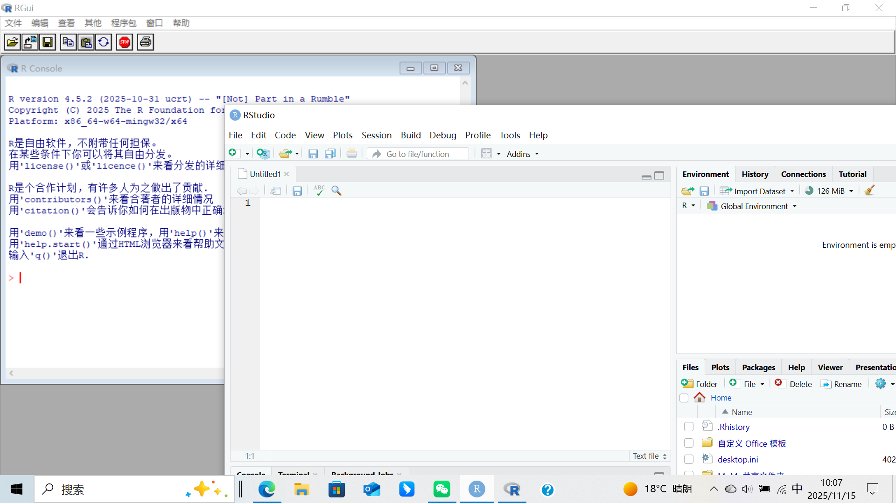
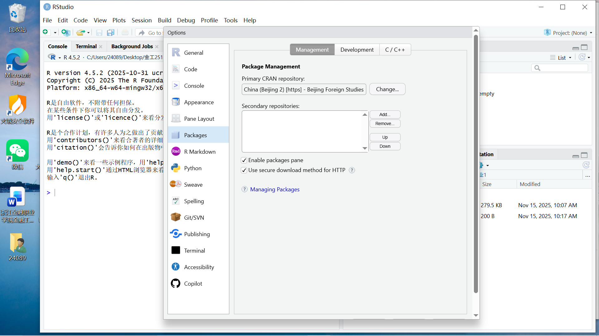
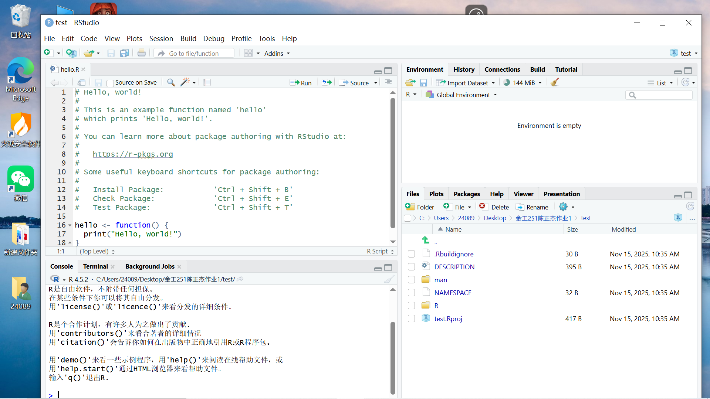
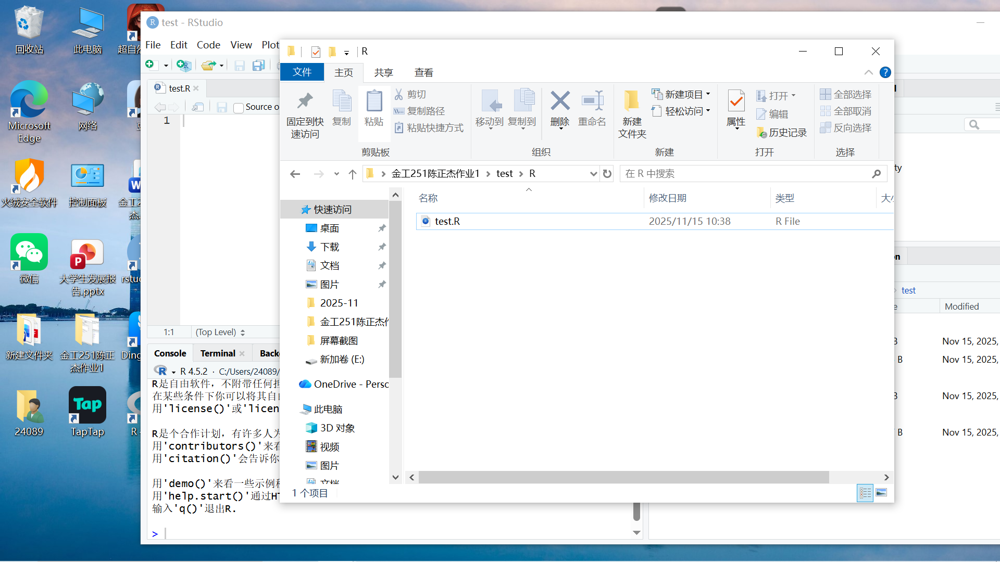
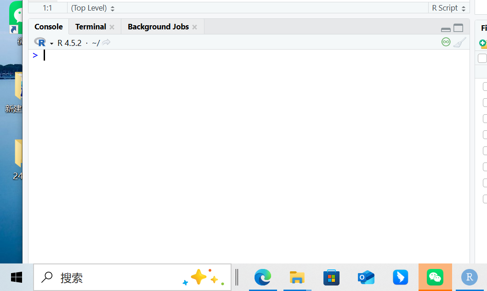
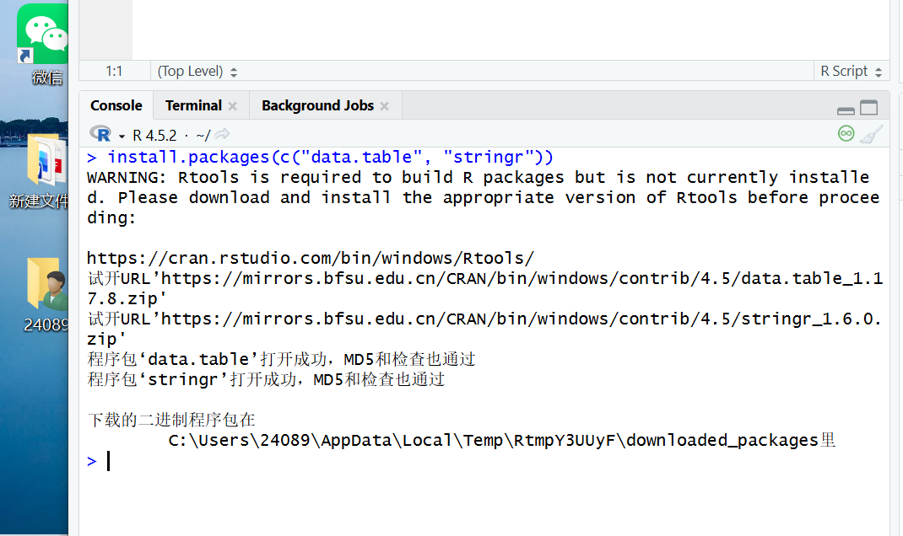
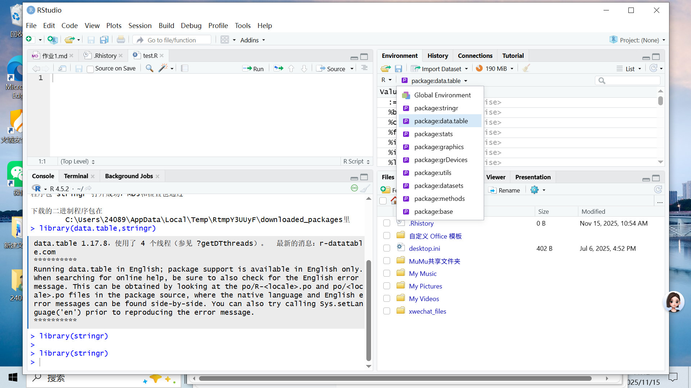
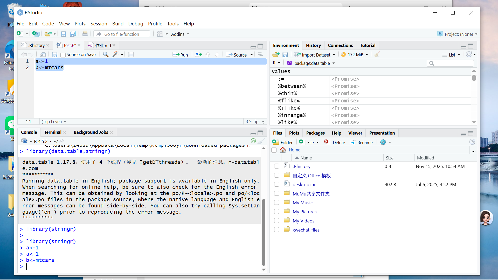
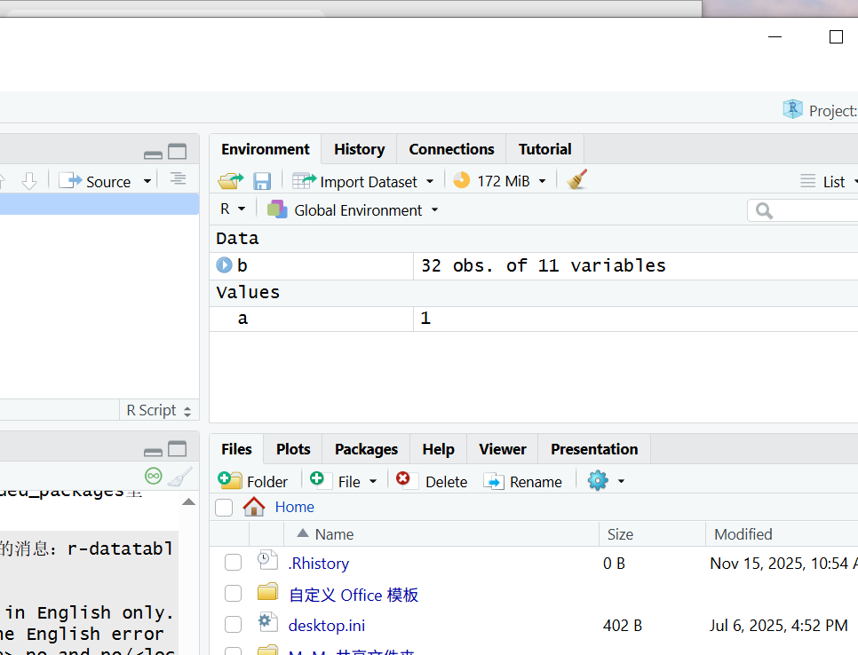

1.1 R语言是一种解释型语言,起源于s语言，主要用来做数据处理之类的工作

1.2 R语言是一门编程语言，而RStudio是专门为使用这门语言而设计的集成开发环境

1.3

1.4

1.5

1.6

2.1运行一行代码：光标选中，再按run，快捷键是win加回车 运行多行代码：选中多行代码，再按run，快捷键依旧是win加回车

2.2

2.3

```         
函数install.packages
```



2.4

```         
函数library
```




2.5不需要重新安装，导入需要再次导入

2.6R语言赋值符号为左箭头，rstudio中赋值符号快捷键为alt+减号



2.7

2.8单行注释：用  # （井号）开头， #  右侧的所有内容都会被视为注释，不会执行;rstudio的快捷键为CTRL+shift+C
